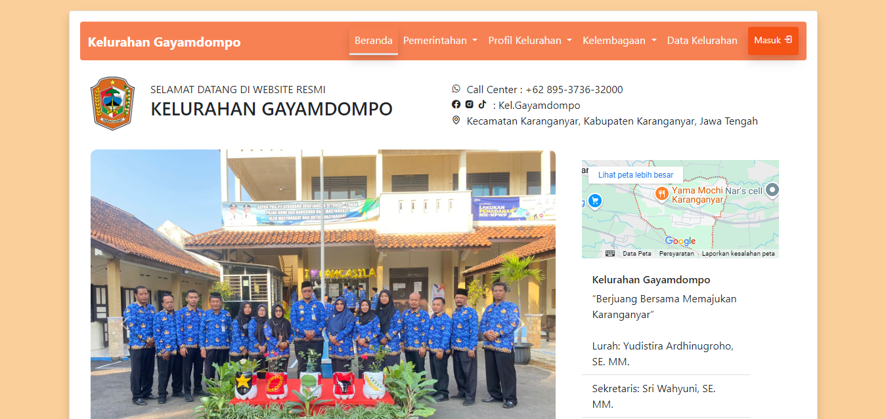
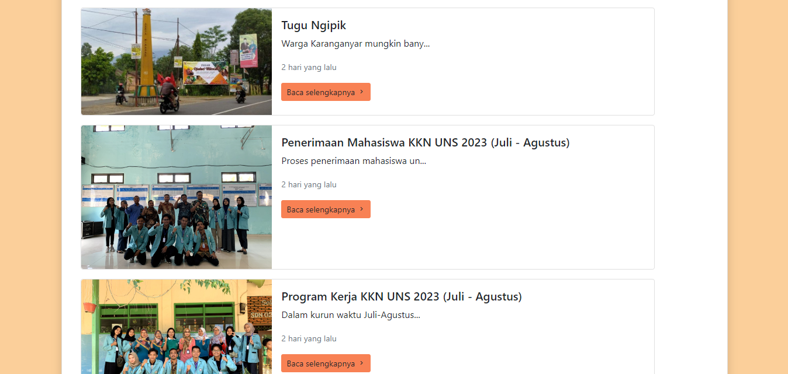
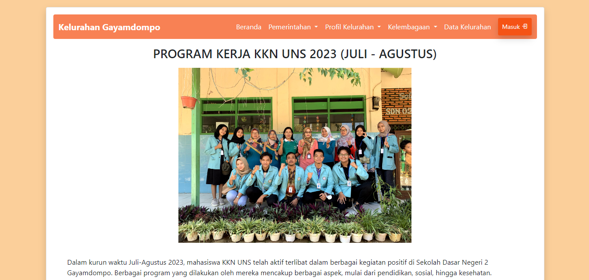
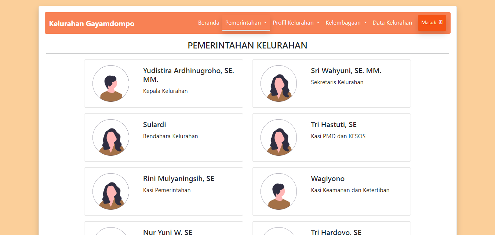
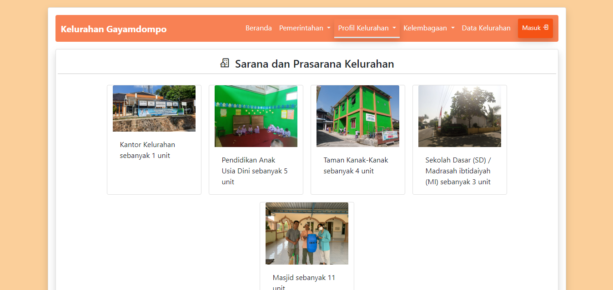
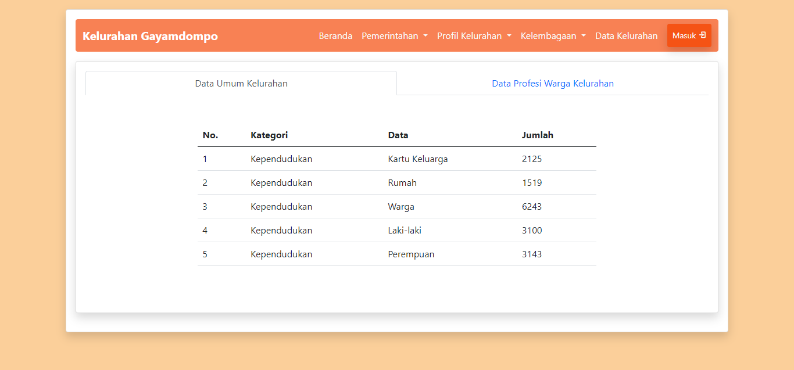
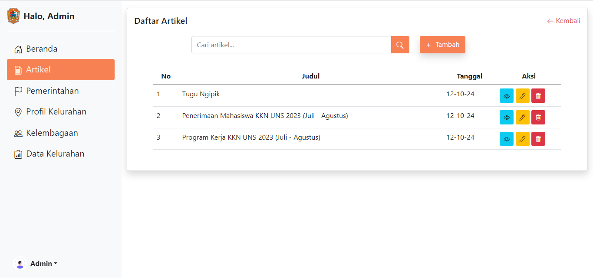
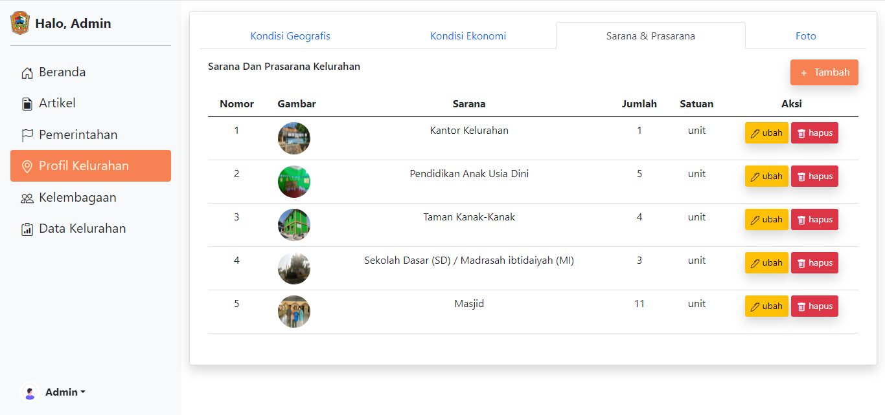

# Gayamdompo Village Profile Website

## 📋 Overview
A Content Management System (CMS) built with Laravel and Bootstrap, developed as part of a community service program (KKN) for Gayamdompo Village. This website aims to enhance information accessibility and showcase the village's potential to a broader audience.

## 🎯 Project Objectives
- Improve easy and quick access to information for the community
- Showcase the natural beauty and local wisdom of Gayamdompo Village
- Encourage community participation in village programs
- Create a strong digital identity for Gayamdompo Village
- Expand the village's digital presence

## 💻 Technology Stack
- **Framework:** Laravel 8.x
- **Frontend:** Bootstrap 5
- **Database:** MySQL
- **Server Requirements:**
  - PHP >= 8.0
  - Composer
  - Node.js & NPM
  - MySQL/MariaDB

## 🚀 Installation

1. Clone the repository
```bash
git clone https://github.com/yourusername/cms-desa-gayamdompo.git
```

2. Install PHP dependencies
```bash
composer install
```

3. Install NPM dependencies
```bash
npm install && npm run dev
```

4. Copy environment file
```bash
cp .env.example .env
```

5. Generate application key
```bash
php artisan key:generate
```

6. Configure database in .env file
```
DB_CONNECTION=mysql
DB_HOST=127.0.0.1
DB_PORT=3306
DB_DATABASE=cms_desa
DB_USERNAME=root
DB_PASSWORD=
```

7. Run migrations and seeders
```bash
php artisan migrate --seed
```

8. Start development server
```bash
php artisan serve
```

## 👥 Project Benefits
1. **Information Access**
   - Easy access to village profile information
   - Government program transparency
   - Population and infrastructure data access

2. **Village Potential Promotion**
   - Tourism destination promotion
   - UMKM product showcasing
   - Local culture preservation

3. **Community Empowerment**
   - Local product promotion
   - Job opportunity information
   - Participation in village development

4. **Government Transparency**
   - Village program information
   - Financial reports
   - Institutional data

## 🙏 Acknowledgments
- Gayamdompo Village Government
- KKN Team 66 Periode Jul - Aug 2023
- Gayamdompo Village Community
- All supporting parties

---
**Note:** This project is part of the KKN program Created by [Tristan Hans Pratama](tristanpratama7@gmailcom) in Gayamdompo Village. Feel free to reach out!!

## 📸 More Screenshots
### Homepage-1 Page

### Homepage-2 Page

### Profil-1 Page

### Profil-2 Page

### Profil-3 Page

### Profil-4 Page

### Admin-1 Page

### Admin-2 Page
